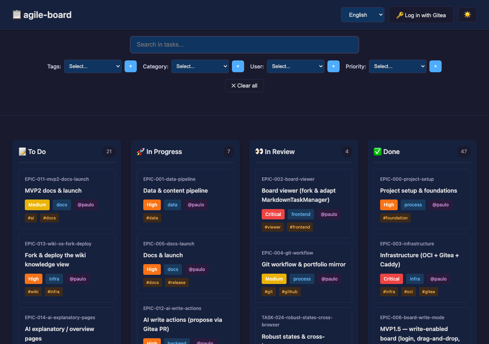
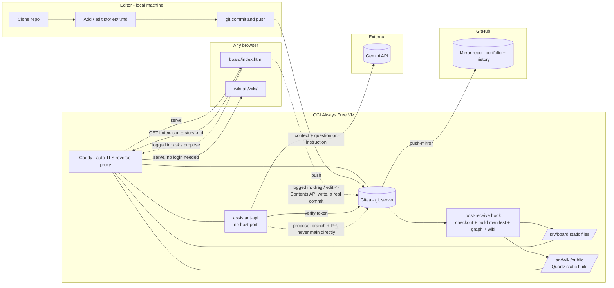

# agile-board

A git-native Kanban board with an AI that can read it and act on it. Stories
are Markdown files in a git repo; a static viewer renders them as a board; a
Gemini-backed assistant can answer questions about it or open a pull request
to change it.



**Live demo:** https://agile-board.duckdns.org/board/ — a personal Always-Free
OCI instance, so treat it as a demo, not an SLA.

## The problem

Team boards (Asana-style: stories, dependencies, status) usually live in a
closed vendor database — paid, seat-limited, hard to diff, and opaque to an AI
that should be reasoning over the team's actual work.

## The solution

- **Markdown + git as the database.** One file per story: frontmatter for
  status/priority/dates/tags, plus graph fields (`depends_on` / `blocks` /
  `related`). Free, diffable, already graph-shaped.
- **A forked viewer, not a new one.** [`board/`](board/) is
  [ioniks/MarkdownTaskManager](https://github.com/ioniks/MarkdownTaskManager)
  (MPL-2.0), made fully browser-based — [NOTICE](NOTICE) has the exact diff.
- **Every edit is a real commit.** Read access is public. Log in with a
  self-service Gitea account to drag cards and edit stories — each save
  lands as a commit under your name.
- **An AI that reads and acts on the board.** Logged in, chat with it: **ask**
  a grounded question, or **propose** a change in plain language. It opens a
  Gitea pull request for you to merge — it never writes to `main` directly.
- **A wiki for non-technical readers.** [`wiki/`](wiki/) is a vendored
  [Quartz](https://github.com/jackyzha0/quartz) build — homepage, search,
  backlinks, and a graph view over the exact same stories, rebuilt statically
  on every push. No login needed, no separate data: browsing connections
  beats scanning columns for someone who just wants to understand the work.
- **Free infrastructure.** [Gitea](https://about.gitea.com/) on an Oracle
  Cloud Always-Free VM is the git server, static host, and assistant backend.
  Also mirrors to GitHub.

## How it works



- A push to `main` — git, a browser edit, or a merged AI proposal, all real
  commits — triggers a Gitea hook that rebuilds `stories/index.json`,
  `stories/graph.json`, and the wiki.
- Caddy serves those as static files; the viewer fetches the manifest and
  lazy-loads a story's Markdown only when its card is opened.
- The assistant backend checks the caller's Gitea token, assembles the
  current board + graph as context, and calls Gemini with a server-only key.
- A proposed change becomes a bounded action list, validated against the
  board's own schema, then opened as a branch + PR — no path writes to
  `main` directly.
- The same hook regenerates the wiki (Quartz, a static-site build, no
  server or database) from the current stories — always in sync with the
  board, never a second copy of the data.

## Using the board

Open the [live link](https://agile-board.duckdns.org/board/) — no account
needed to look around.

**To edit:** click **"Log in with Gitea"** — self-service, one click, no
approval needed. Once logged in you can drag cards between columns and edit a
story's fields directly.

**To ask or propose changes with AI:** once logged in, a **🤖 Assistant**
button appears. Ask a question ("what's blocked on TASK-X?") for a grounded
answer, or describe a change ("mark TASK-X done") — you'll get a link to a
Gitea pull request with exactly that change, ready to review and merge.

**To browse instead of scan:** click **🧠 Wiki** (or go straight to
[the wiki](https://agile-board.duckdns.org/wiki/)) for a homepage, search,
backlinks, and a graph view over the same stories — no login needed, better
suited to "what is this initiative and how did it get here" than a kanban
column is.

**To add a story, or edit relationship fields** (`depends_on` / `blocks` /
`related` / `epic`) **by hand:** still a git workflow. Copy
[`stories/_TEMPLATE.md`](stories/_TEMPLATE.md) to
`stories/TASK-<id>-<slug>.md` (or `EPIC-...`), fill in the frontmatter and
body, then:
```
node scripts/validate-stories.mjs
git add stories/TASK-123-my-story.md
git commit -m "TASK-123: add story for X"
git push
```
The board updates automatically after the push.

## Data model

One Markdown file per story, e.g. [`stories/TASK-030-provision-oci-vm.md`](stories/TASK-030-provision-oci-vm.md):

```markdown
---
id: TASK-030
title: Provision OCI Always Free VM for Gitea
status: todo          # todo | in-progress | in-review | done -> board column
priority: high         # low | medium | high | critical
assignees: ["@paulo"]
depends_on: []         # graph edges: this needs those first
blocks: ["TASK-031"]   # this blocks those
related: ["[[EPIC-003-infrastructure]]"]  # wiki-links -> the knowledge graph
---
## Description
...
## Acceptance Criteria
- [ ] ...
```

| Field | Type | Required | Notes |
| --- | --- | --- | --- |
| `id` | string | yes | Must match the filename: `stories/<id>-<slug>.md`. |
| `title` | string | yes | Card title. |
| `status` | enum | yes | `todo` \| `in-progress` \| `in-review` \| `done` — sets the board column. |
| `priority` | enum | yes | `low` \| `medium` \| `high` \| `critical`. |
| `category` | string | no | Freeform label (e.g. `infra`, `frontend`, `docs`). |
| `assignees` | string[] | no | Handles, e.g. `["@paulo"]`. |
| `epic` | string | no | Parent epic/project id; also a graph node. |
| `created` / `started` / `due` / `finished` | date or null | created is required | `YYYY-MM-DD`. |
| `tags` | string[] | no | Free labels prefixed with `#`. |
| `estimate` | number or null | no | Optional story points. |
| `depends_on` / `blocks` | id[] | no | Graph edges between stories. |
| `related` | `[[id]]`[] | no | Wiki-links — also graph edges. |

Schema: [`docs/story.schema.json`](docs/story.schema.json), enforced by
`node scripts/validate-stories.mjs`. The backlog under [`stories/`](stories/)
is this project's own — dogfooded, not sample data.

## License

Original code (everything except the vendored viewer files) is MIT — see
[LICENSE](LICENSE). Most of `board/scripts/*.js` and all of
`board/styles/*.css` are vendored unmodified from MarkdownTaskManager under
MPL-2.0 ([LICENSE-MPL-2.0](LICENSE-MPL-2.0)). Full file-by-file breakdown:
[NOTICE](NOTICE).

## Credits

Board viewer forked from [ioniks/MarkdownTaskManager](https://github.com/ioniks/MarkdownTaskManager).
