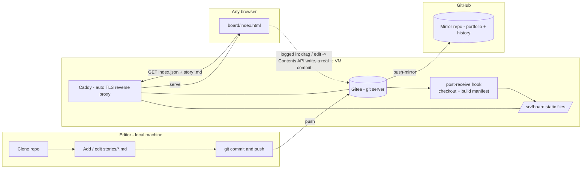

# agile-board

A git-native, Markdown-based agile board. Stories live as plain Markdown files in a
git repository; a single-page viewer renders them as a Kanban board served from a
self-hosted git server. No Asana/Jira license, no vendor database — the data is
just text you can diff, grep, and eventually hand to an LLM.

This is MVP1 of a three-stage plan: get a usable, shareable board out first
(this repo), then layer AI on top of it (see [Roadmap](#roadmap)). Full
reasoning and every design decision are in [docs/PRD.md](docs/PRD.md); this
README is the short version.

**Live demo:** https://agile-board.duckdns.org/board/ — a personal Always-Free
OCI instance, so treat it as a demo, not an SLA.

## The problem

Engineering teams need a shared board (Asana-style: stories, projects,
dependencies). Commercial tools are paid/seat-limited, and their data lives in
a closed vendor database — hard to version, hard to diff, and hard to hand to
an AI that should eventually reason over the team's own work.

## The solution

- **Markdown + git as the database.** Each story is one Markdown file with
  YAML frontmatter (status, priority, assignees, dates, tags, and explicit
  relationship fields like `depends_on`/`blocks`/`related`). Free, diffable,
  offline-capable, and already shaped like graph edges for later.
- **A forked viewer, not a new one.** [`board/`](board/) is
  [ioniks/MarkdownTaskManager](https://github.com/ioniks/MarkdownTaskManager)
  (MPL-2.0), adapted to be entirely web-based: it fetches a generated manifest
  instead of using upstream's native local-folder editor, which this fork
  removes outright (see [NOTICE](NOTICE) for exactly what changed).
- **Self-hosted on free infrastructure.** [Gitea](https://about.gitea.com/) on
  an Oracle Cloud Always-Free VM is the git server *and* what serves the
  board link (via Caddy). No company cloud account required. The repo also
  mirrors to GitHub for portfolio visibility and full history.
- **Editing is a real git commit either way.** Anyone with the link gets a
  read-only board. Log in with your own Gitea account (self-service, nobody
  needs to approve you) and you can drag cards between columns and edit a
  story directly in the browser — each change is a genuine commit, authored
  by you, via Gitea's API, not a database write. Creating a brand-new story
  or editing its relationship fields (`depends_on`/`blocks`/`related`/`epic`)
  is still git-only (see [Adding or updating a story](#adding-or-updating-a-story)).

## How it works



A push to `main` (from git, *or* from a logged-in browser edit — both are
real commits) triggers a Gitea hook that checks the tree out onto the server
and rebuilds `stories/index.json` (a lightweight manifest); Caddy serves that
directory as static files; the viewer fetches the manifest, then lazy-loads a
story's full Markdown only when its card is clicked. Nothing here needs a
backend beyond "a static file server" — the browser talks straight to Gitea's
own API for writes.

## Using the board

Open the [live link](https://agile-board.duckdns.org/board/) — no account
needed to look around. Click **"Log in with Gitea"** to also drag cards
between columns and edit a story's fields; if you don't have an account yet,
Gitea's own sign-up page is one click away and needs no approval. There's
nothing to install and nothing to run locally — this is a hosted, web-only
tool by design (see [NOTICE](NOTICE) for what upstream's original local-only
mode looked like and why it was removed).

## Data model

One Markdown file per story, e.g. [`stories/TASK-030-provision-oci-vm.md`](stories/TASK-030-provision-oci-vm.md):

```markdown
---
id: TASK-030
title: Provision OCI Always Free VM for Gitea
status: todo          # todo | in-progress | in-review | done -> board column
priority: high         # low | medium | high | critical
assignees: ["@paulo"]
depends_on: []         # graph edges: this needs those first
blocks: ["TASK-031"]   # this blocks those
related: ["[[EPIC-003-infrastructure]]"]  # wiki-links -> future knowledge graph
---
## Description
...
## Acceptance Criteria
- [ ] ...
```

Full field reference: [docs/CONTRIBUTING.md](docs/CONTRIBUTING.md#field-reference).
Machine-readable schema: [docs/story.schema.json](docs/story.schema.json), enforced by
`node scripts/validate-stories.mjs`. This project's own backlog is dogfooded as
real stories under [`stories/`](stories/) — the repo's history *is* the board.

## Self-hosting

Full walkthrough (OCI VM → firewall → DNS → Docker Compose → Gitea → publish
hook → GitHub mirror → OAuth2 app for browser login): [docs/RUNBOOK.md](docs/RUNBOOK.md).
Infra-as-code lives in [`infra/`](infra/) (Gitea + Caddy via Docker Compose,
auto-HTTPS, the publish hook). Once deployed, the board is reachable at
`https://<your-domain>/board/`.

## Adding or updating a story

Logged-in browser editing (see [Using the board](#using-the-board)) covers
moving a card and editing its everyday fields. Creating a brand-new story, or
touching its relationship fields (`depends_on`/`blocks`/`related`/`epic`),
is still a git workflow: copy [`stories/_TEMPLATE.md`](stories/_TEMPLATE.md),
fill in the frontmatter, commit, push. Full guide:
[docs/CONTRIBUTING.md](docs/CONTRIBUTING.md).

## Roadmap

- **MVP1 (this repo).** A usable, shareable board backed by git: read-only
  for anyone with the link, real editing (login, drag-and-drop, edit modal)
  for anyone with a Gitea account — self-service, no approval needed.
- **MVP2 — AI control layer.** Build a knowledge graph from the frontmatter
  edges (`depends_on`/`blocks`/`related`/`epic`) and `[[wiki-links]]`, then put
  a Gemini-backed assistant on top that both **answers** questions grounded in
  the graph ("what's the team working on?", "what depends on X?" — Karpathy
  "wiki-LLM" style) *and* **acts** on plain-language instructions ("mark X done,
  split Y into two stories") by drafting the changes as a Gitea pull request you
  review and merge. The AI controls the board; you approve every change it makes.
  Planned in detail in [docs/PRD.md §14](docs/PRD.md).
- **MVP3 — Auto-ingest.** Ingest transcripts of dailies/plannings, extract
  status changes and new dependencies, and feed them into that same MVP2
  propose-via-PR pipeline for human approval — the transcript becomes the
  on-ramp to a write path that already exists.

Full detail and current status: [docs/PRD.md](docs/PRD.md) ·
[docs/TASKS.md](docs/TASKS.md).

## License

Original code (everything except the vendored viewer files) is MIT — see
[LICENSE](LICENSE). Most of `board/scripts/*.js` and all of
`board/styles/*.css` are vendored unmodified from MarkdownTaskManager under
MPL-2.0 ([LICENSE-MPL-2.0](LICENSE-MPL-2.0)); a few files upstream shipped
for its local-only editing mode were removed rather than carried forward,
since this fork is web-only. Full file-by-file breakdown:
[NOTICE](NOTICE).

## Credits

Board viewer forked from [ioniks/MarkdownTaskManager](https://github.com/ioniks/MarkdownTaskManager).
