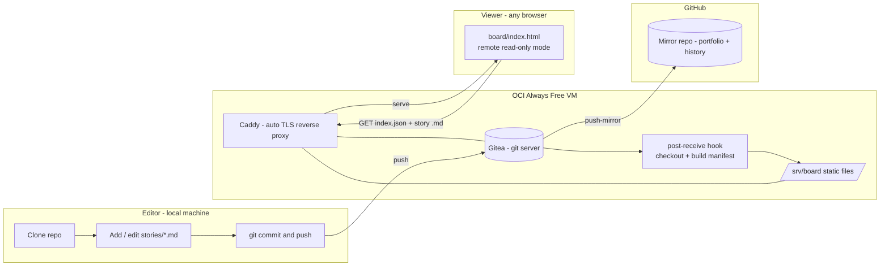

# agile-board

A git-native, Markdown-based agile board. Stories live as plain Markdown files in a
git repository; a single-page viewer renders them as a Kanban board served from a
self-hosted git server. No Asana/Jira license, no vendor database — the data is
just text you can diff, grep, and eventually hand to an LLM.

This is MVP1 of a three-stage plan: get a usable, shareable board out first
(this repo), then layer AI on top of it (see [Roadmap](#roadmap)). Full
reasoning and every design decision are in [docs/PRD.md](docs/PRD.md); this
README is the short version.

## The problem

Engineering teams need a shared board (Asana-style: stories, projects,
dependencies). Commercial tools are paid/seat-limited, and their data lives in
a closed vendor database — hard to version, hard to diff, and hard to hand to
an AI that should eventually reason over the team's own work.

## The solution

- **Markdown + git as the database.** Each story is one Markdown file with
  YAML frontmatter (status, priority, assignees, dates, tags, and explicit
  relationship fields like `depends_on`/`blocks`/`related`). Free, diffable,
  offline-capable, and already shaped like graph edges for later.
- **A forked viewer, not a new one.** [`board/`](board/) is
  [ioniks/MarkdownTaskManager](https://github.com/ioniks/MarkdownTaskManager)
  (MPL-2.0) with one addition layered on top: a read-only mode that fetches a
  generated manifest instead of using its native local-folder editor. Every
  vendored upstream file is byte-for-byte unmodified — see [NOTICE](NOTICE).
- **Self-hosted on free infrastructure.** [Gitea](https://about.gitea.com/) on
  an Oracle Cloud Always-Free VM is the git server *and* what serves the
  board link (via Caddy). No company cloud account required. The repo also
  mirrors to GitHub for portfolio visibility and full history.
- **Editing is git, not a web form.** Clone → edit a Markdown file → commit →
  push. The public link is read-only by design for MVP1 (see
  [PRD §4](docs/PRD.md#4-solution--rationale) for the full rationale).

## How it works



A push to `main` triggers a Gitea hook that checks the tree out onto the
server and rebuilds `stories/index.json` (a lightweight manifest); Caddy
serves that directory as static files; the viewer fetches the manifest, then
lazy-loads a story's full Markdown only when its card is clicked. Nothing
here needs a backend beyond "a static file server."

## Try it locally (no cloud needed)

```
git clone <this-repo>
cd agile-board
node scripts/build-manifest.mjs   # scans stories/*.md -> stories/index.json
python3 -m http.server 8420       # any static file server works
```
Open `http://localhost:8420/board/index.html` — the board renders straight
from the `stories/` folder. Requires only Node 18+ and a static file server;
zero `npm install`, zero build step.

## Data model

One Markdown file per story, e.g. [`stories/TASK-030-provision-oci-vm.md`](stories/TASK-030-provision-oci-vm.md):

```markdown
---
id: TASK-030
title: Provision OCI Always Free VM for Gitea
status: todo          # todo | in-progress | in-review | done -> board column
priority: high         # low | medium | high | critical
assignees: ["@paulo"]
depends_on: []         # graph edges: this needs those first
blocks: ["TASK-031"]   # this blocks those
related: ["[[EPIC-003-infrastructure]]"]  # wiki-links -> future knowledge graph
---
## Description
...
## Acceptance Criteria
- [ ] ...
```

Full field reference: [docs/CONTRIBUTING.md](docs/CONTRIBUTING.md#field-reference).
Machine-readable schema: [docs/story.schema.json](docs/story.schema.json), enforced by
`node scripts/validate-stories.mjs`. This project's own backlog is dogfooded as
real stories under [`stories/`](stories/) — the repo's history *is* the board.

## Self-hosting

Full walkthrough (OCI VM → firewall → DNS → Docker Compose → Gitea → publish
hook → GitHub mirror): [docs/RUNBOOK.md](docs/RUNBOOK.md). Infra-as-code lives
in [`infra/`](infra/) (Gitea + Caddy via Docker Compose, auto-HTTPS, the
publish hook). Once deployed, the board is reachable at
`https://<your-domain>/board/`.

## Adding or updating a story

No web form — it's a git workflow: copy [`stories/_TEMPLATE.md`](stories/_TEMPLATE.md),
fill in the frontmatter, commit, push. Full guide:
[docs/CONTRIBUTING.md](docs/CONTRIBUTING.md).

## Roadmap

- **MVP1 (this repo).** A usable, shareable, read-only board backed by git.
- **MVP2 — Ask & relate.** Build a knowledge graph from the frontmatter edges
  (`depends_on`/`blocks`/`related`/`epic`) and `[[wiki-links]]`, plus retrieval
  over story bodies. An assistant answers "what's the team working on?" and
  "what depends on X?" — Karpathy "wiki-LLM" style.
- **MVP3 — Auto-ingest.** Ingest transcripts of dailies/plannings, extract
  status changes and new dependencies, and propose them as a Gitea branch/PR
  for human approval.

Full detail and current status: [docs/PRD.md](docs/PRD.md) ·
[docs/TASKS.md](docs/TASKS.md).

## License

Original code (everything except the vendored viewer files) is MIT — see
[LICENSE](LICENSE). `board/scripts/00-*.js` through `12-*.js` and
`board/styles/*.css` are vendored unmodified from MarkdownTaskManager under
MPL-2.0 ([LICENSE-MPL-2.0](LICENSE-MPL-2.0)). Full file-by-file breakdown:
[NOTICE](NOTICE).

## Credits

Board viewer forked from [ioniks/MarkdownTaskManager](https://github.com/ioniks/MarkdownTaskManager).
