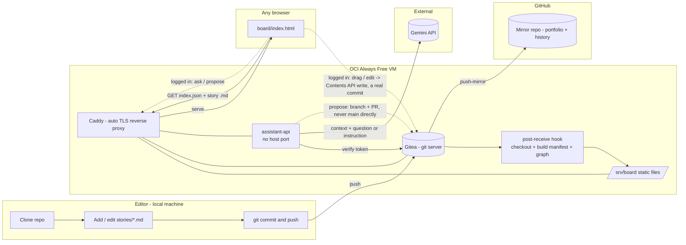

# agile-board

A git-native, Markdown-based agile board with an AI that understands and helps
manage it. Stories live as plain Markdown files in a git repository; a
single-page viewer renders them as a Kanban board, and a Gemini-backed
assistant can answer questions about the board or propose changes as a Gitea
pull request you review and merge.

**Live demo:** https://agile-board.duckdns.org/board/ — a personal Always-Free
OCI instance, so treat it as a demo, not an SLA.

## The problem

Engineering teams need a shared board (Asana-style: stories, projects,
dependencies). Commercial tools are paid/seat-limited, and their data lives in
a closed vendor database — hard to version, hard to diff, and hard to hand to
an AI that should reason over the team's own work.

## The solution

- **Markdown + git as the database.** Each story is one Markdown file with
  YAML frontmatter (status, priority, assignees, dates, tags, and explicit
  relationship fields like `depends_on`/`blocks`/`related`). Free, diffable,
  offline-capable, and already shaped like graph edges for an AI to reason over.
- **A forked viewer, not a new one.** [`board/`](board/) is
  [ioniks/MarkdownTaskManager](https://github.com/ioniks/MarkdownTaskManager)
  (MPL-2.0), adapted to be entirely web-based (see [NOTICE](NOTICE) for
  exactly what changed).
- **Editing is a real git commit either way.** Anyone with the link gets a
  read-only board. Log in with your own Gitea account (self-service, nobody
  needs to approve you) and you can drag cards between columns and edit a
  story directly in the browser — each change is a genuine commit, authored
  by you, via Gitea's API, not a database write.
- **An AI that understands *and* acts on the board.** Logged in, a chat panel
  lets you **ask** a question grounded in the actual current stories and their
  relationships, or **propose** a change in plain language ("mark X done and
  split Y into two stories") — the assistant drafts the exact changes and
  opens a **Gitea pull request** for you to review and merge. Nothing reaches
  the live board without that merge, so "the AI controls the board" and "a
  person approved every change" are both true at once.
- **Self-hosted on free infrastructure.** [Gitea](https://about.gitea.com/) on
  an Oracle Cloud Always-Free VM is the git server, the board's static host,
  and the assistant's backend — no company cloud account required. The repo
  also mirrors to GitHub for full history.

## How it works



A push to `main` (from git, a logged-in browser edit, or a merged AI proposal
— all real commits) triggers a Gitea hook that checks the tree out onto the
server and rebuilds `stories/index.json` (card metadata) and
`stories/graph.json` (the relationship graph); Caddy serves that directory as
static files; the viewer fetches the manifest, then lazy-loads a story's full
Markdown only when its card is clicked.

The assistant backend (`assistant-api`) verifies the caller's Gitea token,
assembles the current board + graph as context, and calls Gemini with a
server-side-only API key (never exposed to the browser). For a proposed
change, it applies a bounded set of actions (move a card, edit a field, link
or split stories, ...), validates the result against the same schema the
board itself enforces, and opens a branch + pull request through Gitea's API
— it has no code path that writes to `main` directly.

## Using the board

Open the [live link](https://agile-board.duckdns.org/board/) — no account
needed to look around.

**To edit:** click **"Log in with Gitea"** — self-service sign-up, one click,
no approval needed. Once logged in you can drag cards between columns and
edit a story's fields directly.

**To ask or propose changes with AI:** once logged in, a **🤖 Assistant**
button appears. Type a question ("what's blocked on TASK-X?") for a grounded
answer, or switch to "Propose a change" and describe what you want ("mark
TASK-X done") — you'll get a link to a Gitea pull request with exactly that
change, ready for you to review and merge.

**To add a new story, or edit a story's relationships** (`depends_on` /
`blocks` / `related` / `epic`) **by hand:** these stay a git workflow rather
than a UI form. Clone the repo, copy [`stories/_TEMPLATE.md`](stories/_TEMPLATE.md)
to `stories/TASK-<id>-<slug>.md` (or `EPIC-...`), fill in the frontmatter and
body, then:
```
node scripts/validate-stories.mjs   # check it against the schema
git add stories/TASK-123-my-story.md
git commit -m "TASK-123: add story for X"
git push
```
The board updates automatically after the push.

## Data model

One Markdown file per story, e.g. [`stories/TASK-030-provision-oci-vm.md`](stories/TASK-030-provision-oci-vm.md):

```markdown
---
id: TASK-030
title: Provision OCI Always Free VM for Gitea
status: todo          # todo | in-progress | in-review | done -> board column
priority: high         # low | medium | high | critical
assignees: ["@paulo"]
depends_on: []         # graph edges: this needs those first
blocks: ["TASK-031"]   # this blocks those
related: ["[[EPIC-003-infrastructure]]"]  # wiki-links -> the knowledge graph
---
## Description
...
## Acceptance Criteria
- [ ] ...
```

| Field | Type | Required | Notes |
| --- | --- | --- | --- |
| `id` | string | yes | Must match the filename: `stories/<id>-<slug>.md`. |
| `title` | string | yes | Card title. |
| `status` | enum | yes | `todo` \| `in-progress` \| `in-review` \| `done` — sets the board column. |
| `priority` | enum | yes | `low` \| `medium` \| `high` \| `critical`. |
| `category` | string | no | Freeform label (e.g. `infra`, `frontend`, `docs`). |
| `assignees` | string[] | no | Handles, e.g. `["@paulo"]`. |
| `epic` | string | no | Parent epic/project id; also a graph node. |
| `created` / `started` / `due` / `finished` | date or null | created is required | `YYYY-MM-DD`. |
| `tags` | string[] | no | Free labels prefixed with `#`. |
| `estimate` | number or null | no | Optional story points. |
| `depends_on` / `blocks` | id[] | no | Graph edges between stories. |
| `related` | `[[id]]`[] | no | Wiki-links — also graph edges. |

Machine-readable schema: [`docs/story.schema.json`](docs/story.schema.json),
enforced by `node scripts/validate-stories.mjs`. This project's own backlog is
dogfooded as real stories under [`stories/`](stories/) — the repo's history
*is* the board.

## License

Original code (everything except the vendored viewer files) is MIT — see
[LICENSE](LICENSE). Most of `board/scripts/*.js` and all of
`board/styles/*.css` are vendored unmodified from MarkdownTaskManager under
MPL-2.0 ([LICENSE-MPL-2.0](LICENSE-MPL-2.0)). Full file-by-file breakdown:
[NOTICE](NOTICE).

## Credits

Board viewer forked from [ioniks/MarkdownTaskManager](https://github.com/ioniks/MarkdownTaskManager).
