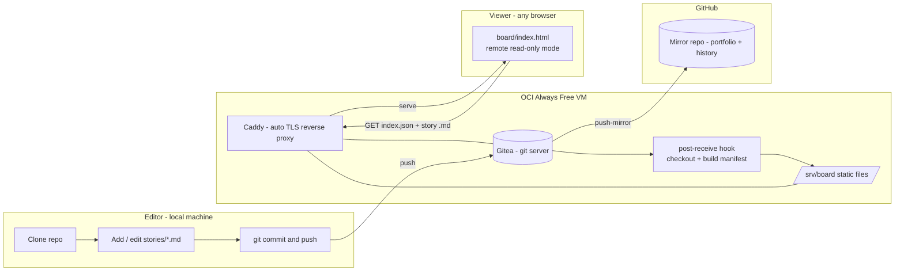

# PRD — agile-board

> A git-native, Markdown-based agile board. Stories live as Markdown files in a git
> repository; a single-file web viewer renders them as a Kanban board served from a
> self-hosted Gitea instance. Built to be copied: minimal moving parts, no vendor lock-in,
> and a data model ready for AI on top.

**Status:** Live (MVP1, extended — see D6) · **Owner:** Paulo Musachio · **Last updated:** 2026-07-04
**Working title:** `agile-board` (final product name TBD)

> This document was written before the build started and is kept as the
> planning record — decisions are dated, not silently rewritten. Where the
> shipped result diverges from the original plan (notably: write-mode, added
> post-launch — see decision D6), that's called out explicitly rather than
> edited away.

---

## 1. Problem

Technology teams need an agile board (Asana-style) to track stories, projects and
dependencies. Asana and equivalents are:

- **Paid / seat-limited** — "não dá para dar licença de GitHub/Asana para todo mundo".
  Not everyone on the team has (or should need) an account on a commercial SaaS.
- **Opaque data** — the source of truth lives in a vendor DB. It is hard to version,
  hard to diff, and hard to feed to an AI that should reason over the team's work.
- **Closed to automation** — the long-term goal is an assistant that answers questions
  about the team's activity and, eventually, updates the board from meeting transcripts.
  That is only tractable if the data is plain text, versioned, and locally readable.

We want the board's source of truth to be **plain Markdown in git**: free, portable,
diffable, offline-capable, and trivially consumable by an LLM.

## 2. Goals & Non-Goals (MVP1)

**Goals**
- G1 — A shareable **online board** reachable by link. Anyone we send the link to can
  open it and see the team's Kanban board (read-only), on any modern browser.
- G2 — Stories stored as **one Markdown file per story** in a git repo, with a defined
  frontmatter schema (relationships included) so the data is AI-ready from day one.
- G3 — Self-hosted on **free infrastructure** (Oracle Cloud "Always Free" + Gitea),
  outside any company environment.
- G4 — Full traceability: repository mirrored to **GitHub** with complete history and a
  **minimal-but-complete README** so a stranger can reproduce the whole project.
- G5 — Editing works through a plain **git workflow** (clone → edit Markdown → commit →
  push); the board reflects changes after push. *(Superseded by D6: read-only-plus-git
  proved too limited in practice once the board was actually used day-to-day — the board
  now also supports logged-in browser editing, still landing as real git commits via
  Gitea's API. Git remains the only way to create a new story or edit the graph-edge
  fields.)*

**Non-Goals (explicitly out of scope for MVP1)**
- Anonymous/unauthenticated writes through the link — logged-in editing was added (D6),
  but always attributed to a real Gitea account, never open to anyone with just the URL.
- Any AI feature (that is MVP2 / MVP3).
- Authentication beyond an optional basic-auth on the public board.
- Native mobile app; rich project hierarchy beyond a simple `epic` tag; notifications;
  time tracking; reporting dashboards.

## 3. Users

| Persona | Needs from MVP1 |
| --- | --- |
| **Viewer** (any teammate, non-technical, no account) | Open a link, see the current board, click a card to read details. No install, no login. |
| **Editor** (developer / scrum master) | Add and update stories as Markdown, commit and push; see the board update. |
| **Maintainer** (you) | Stand up and operate the Gitea/OCI host; keep GitHub mirror in sync; onboard editors. |
| **Copier** (portfolio audience) | Read the README and reproduce the entire setup without asking questions. |

## 4. Solution & rationale

**Chosen approach:** fork the single-file [MarkdownTaskManager](https://github.com/ioniks/MarkdownTaskManager)
Kanban viewer, adapt it to read **one Markdown file per story from a remote base URL in
read-only mode**, store stories in a git repo hosted on **self-managed Gitea (OCI)**, and
**mirror to GitHub** for portfolio + traceability.

Why these pieces:

- **Markdown + git as the database** — free, diffable, portable, offline, and the ideal
  input for the MVP2/MVP3 AI. Every change is an auditable commit.
- **MarkdownTaskManager (fork, not build)** — a proven, dependency-free, single-HTML
  Kanban renderer. We reuse its rendering/board mechanics and add only what we need
  (remote read-only load + per-file frontmatter parsing). MPL-2.0 permits this
  (see §12).
- **One file per story** (vs. the tool's native single `kanban.md`) — clean git diffs,
  per-story history/blame, and a natural node for the future knowledge graph via
  `[[wiki-links]]` and relationship fields.
- **Gitea on OCI Always Free** — a real self-hosted git server on genuinely free
  infrastructure, matching the "not everyone has GitHub" constraint and the eventual
  company-internal deployment. Serves the board link itself.
- **GitHub mirror** — portfolio visibility and change traceability, without making a
  GitHub account a requirement to *use* the board.

## 5. Architecture (MVP1)



**Flow:** an editor pushes Markdown to Gitea → a `post-receive` hook checks out `main`
into `/srv/board` and regenerates `index.json` → Caddy serves the static board + stories
over HTTPS → a viewer opens the link and the page fetches `index.json` (card metadata)
and lazily fetches each story's body → Gitea push-mirrors the repo to GitHub.

## 6. Data model — story files

One file per story: `stories/TASK-<id>-<slug>.md`. YAML frontmatter carries structured,
AI-friendly fields (a superset of MarkdownTaskManager's inline metadata); the body holds
human content.

```markdown
---
id: TASK-001
title: Provision OCI Always Free VM for Gitea
status: in-progress          # todo | in-progress | in-review | done  (board columns)
priority: high               # low | medium | high | critical
category: infra              # freeform label / swimlane
assignees: ["@paulo"]
epic: EPIC-board-mvp1        # project / epic grouping (also a graph node)
created: 2026-07-04
started: 2026-07-04
due: 2026-07-11
finished:
tags: ["#infra", "#oci", "#gitea"]
estimate: 3                  # optional story points
depends_on: ["TASK-000"]     # graph edge: this needs those first
blocks: ["TASK-030"]         # graph edge: this blocks those
related: ["[[EPIC-board-mvp1]]", "[[TASK-033]]"]  # wiki-links -> future graph
---

## Description
Stand up the free ARM VM that will host Gitea and the board.

## Acceptance Criteria
- [ ] VM reachable over SSH
- [ ] Ports 80/443 open (security list + OS firewall)

## Subtasks
- [ ] Create instance
- [ ] Harden SSH

## Notes
Ampere A1 free tier can be capacity-constrained; see runbook for retries.
```

Design notes:
- `status` values map 1:1 to board columns; changing `status` moves the card.
- Relationship fields (`depends_on`, `blocks`, `related`, `epic`) and `[[wiki-links]]`
  are the **edges of the MVP2 knowledge graph**. They are optional in MVP1 but validated
  when present.
- A generated `stories/index.json` (built by a script / the post-receive hook) lists all
  stories with cached frontmatter so the viewer renders the board from one small request
  and lazy-loads bodies on click (no HTTP directory listing required).
- A machine-checkable schema (`docs/story.schema.json`) backs a validation step.

## 7. The board viewer (adaptation scope)

Fork MarkdownTaskManager into `board/`. Keep upstream file(s) under MPL-2.0 with notices.
Adaptations for MVP1:

1. **Remote read-only mode** — a config/URL param pointing at a base URL; fetch
   `index.json`, render columns by `status`, lazy-fetch a story's body on card click.
2. **Frontmatter parsing** — parse YAML frontmatter (small vanilla parser, no new deps)
   into the card model, replacing the tool's native `### TASK-nnn | Title` block parser.
3. **Read-only detail view** — render description / acceptance / subtasks / notes;
   no writes in remote mode.
4. **Robust states** — empty board, fetch error, and cross-browser support for the
   read path (Chromium, Firefox, Safari).
5. **Write mode (D6, post-launch addition)** — a "Log in with Gitea" button (OAuth2 +
   PKCE, self-service accounts, no approval needed) unlocks upstream's own drag-and-drop
   and edit-task modal for logged-in users, persisting through Gitea's Contents API as
   real commits. Upstream's *local-folder* edit mode (File System Access API,
   Chromium-only) was removed outright rather than adapted — see NOTICE — since this
   product is web-only by design.

## 8. Infrastructure & operations

- **Host:** OCI Always Free Ampere A1 (ARM) VM, Ubuntu LTS.
- **Stack:** Docker Compose — `gitea` + `caddy` (automatic HTTPS via Let's Encrypt).
- **Domain/TLS:** free subdomain (e.g. DuckDNS) so Caddy can issue a real certificate.
- **Networking gotcha:** open 22/80/443 in the OCI **security list/NSG** *and* in the
  instance **OS firewall** (Oracle Ubuntu images ship restrictive `iptables` rules) — a
  classic "why is my port closed" trap; it goes in the runbook.
- **Publish pipeline:** Gitea `post-receive` hook (or Gitea Actions) checks out `main`
  into `/srv/board` and regenerates `index.json`; Caddy serves `/srv/board` as static
  files. Board link = `https://<subdomain>/`.
- **Access:** public read-only for the demo; document optional Caddy basic-auth to lock
  it down. Gitea's own auth governs who can push/edit.
- **Secrets:** Gitea admin creds and the GitHub mirror token are never committed;
  documented as environment/setup steps.

## 9. Git workflow & traceability

- **Remotes:** `gitea` (OCI, source of truth for the board) and GitHub (portfolio).
- **Recommended:** editors push to Gitea; Gitea **push-mirrors** to GitHub automatically —
  one push, full history preserved on GitHub for the portfolio. (Alternative: manual dual
  remotes.)
- **Convention:** each commit references a story id (e.g. `TASK-001:`); the board's own
  build backlog is dogfooded as stories in `stories/`, so the project's history *is* the
  board.

## 10. Definition of Done (MVP1)

- [x] A person given the link opens it in a normal browser and sees the live Kanban board
      with real cards, read-only, no login. **Verified** at https://agile-board.duckdns.org/board/.
- [x] Stories exist as one Markdown file each, valid against the frontmatter schema.
      **Verified** — 39/39 pass `scripts/validate-stories.mjs`.
- [x] An editor can clone, add/edit a story, push, and see the board reflect it.
      **Verified** across multiple real pushes during development.
- [x] Repo is on GitHub with full history and a minimal, complete README that lets a
      stranger reproduce everything (infra runbook + how to add a story).
- [ ] The OCI + Gitea + Caddy setup is reproducible from the documented runbook.
      Runbook reflects exactly what worked (updated in place as real gotchas were hit
      live), but hasn't been independently re-run by someone else from a blank slate.
- [x] *(D6, added)* A logged-in user (including a freshly self-registered account) can
      drag a card and edit a story, landing as a real commit; anonymous read-only
      behavior is unaffected. **Verified** live, including the self-registration path
      end-to-end via the OAuth2 token exchange.

## 11. Roadmap (post-MVP1)

- **MVP2 — Ask & relate (AI over the graph).** Build a knowledge graph from frontmatter
  edges (`depends_on`/`blocks`/`related`/`epic`) + `[[wiki-links]]`, plus retrieval over
  story bodies. An assistant answers "what is the team working on?", "what blocks
  TASK-x?", "how do these projects relate?" — Karpathy "wiki-LLM" style. Adds a chat
  panel to the board. (Model TBD: Gemini per current preference, or Claude.)
- **MVP3 — Auto-ingest rituals.** Pipeline ingests transcripts of dailies/plannings,
  extracts status changes / new tasks / decisions / dependencies, and proposes them as a
  **branch/PR on Gitea** for human approval before merge. Human-in-the-loop; the board
  updates itself once merged.

## 12. Risks & mitigations

| Risk | Mitigation |
| --- | --- |
| OAuth2 token scope isn't per-repo in Gitea | A logged-in token can write anywhere the account can, not just this repo — acceptable for a small team on a dedicated instance; documented as a known limitation, not silently assumed. |
| Contents-API 409 conflicts (two writers, same story) | No auto-merge, no silent overwrite — surfaced as a clear "reload and retry" error. |
| MPL-2.0 obligations on the fork | Keep adapted upstream file(s) under MPL-2.0 with preserved notices + a `NOTICE`; new original code under MIT; repo is public so source-availability is satisfied. |
| OCI Always Free ARM capacity shortages | Retry across ADs/regions; fallbacks: OCI x86 micro, Fly.io free, low-cost Hetzner. |
| OCI firewall/iptables port trap | Explicit runbook step for security list + OS firewall. |
| Per-file data model = more viewer work than "small changes" | Keep viewer parsing minimal (frontmatter only); reuse upstream rendering/DnD as-is. Write mode (D6) later added a matching serializer, verified via a round-trip test against every real story before ever touching the live board. |
| Free domain / Let's Encrypt rate limits | DuckDNS + Caddy; cache certs on a persistent volume. |
| Leaking secrets (Gitea admin, mirror token) | Never commit; `.gitignore` + documented env setup. |

## 13. Decisions log

| # | Decision | Choice | Date |
| --- | --- | --- | --- |
| D1 | README/docs language | **English** | 2026-07-04 |
| D2 | Host for the shareable board link | **Gitea on OCI** (GitHub as mirror) | 2026-07-04 |
| D3 | Story storage model | **One Markdown file per story** (frontmatter + `[[wiki-links]]`) | 2026-07-04 |
| D4 | MVP1 editing scope | **Read-only shared link + local editing via git** | 2026-07-04 |
| D5 | Viewer base | **Fork MarkdownTaskManager** (MPL-2.0) | 2026-07-04 |
| D6 | MVP1 editing scope, revisited | **Add logged-in browser editing** (Gitea OAuth2 + PKCE, drag-and-drop, edit modal, writes via Contents API as real commits) alongside git; **remove** upstream's local File System Access edit mode entirely rather than keep it dormant | 2026-07-04 |

**Why D6:** after using the live MVP1 board for real, read-only-plus-git proved too
limited day-to-day — no drag-and-drop, no way to add information to a card without a
local checkout, and "git-only" was itself a barrier for exactly the non-technical
teammates this project set out to include. Self-service Gitea accounts (no approval
needed) resolved the access concern without needing Google or any new infrastructure.

**Still open:** final product name; MVP2 model (Gemini vs Claude).
